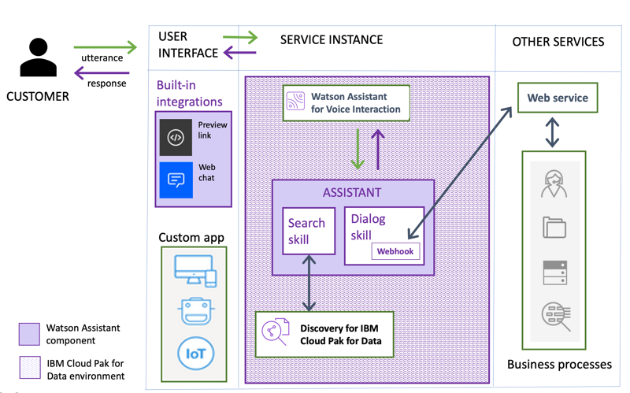

---

copyright:
  years: 2015, 2023
lastupdated: "2023-02-09"

subcollection: assistant-data

---

{:shortdesc: .shortdesc}
{:new_window: target="_blank"}
{:external: target="_blank" .external}
{:deprecated: .deprecated}
{:important: .important}
{:note: .note}
{:tip: .tip}
{:pre: .pre}
{:codeblock: .codeblock}
{:screen: .screen}
{:javascript: .ph data-hd-programlang='javascript'}
{:java: .ph data-hd-programlang='java'}
{:python: .ph data-hd-programlang='python'}
{:swift: .ph data-hd-programlang='swift'}
{:download: .download}
{:gif: data-image-type='gif'}

# About {{site.data.keyword.conversationshort}}
{: #index}

Use {{site.data.keyword.conversationfull}} for {{site.data.keyword.icp4dfull}} to build your own branded assistant into any device, application, or channel. Connect your assistant to the customer engagement resources you already use to deliver an engaging, unified problem-solving experience to your customers.
{: shortdesc}

| | |
|------------|-------------|
| *Create AI-driven conversational flows* | Your assistant leverages industry-leading AI capabilities to understand questions that your customers ask in natural language. It uses machine learning models that are custom built from your data to deliver accurate answers in real time. |
| *Embed existing help content* | You already know the answers to customer questions? Put your subject matter expertise to work. Add a search skill to give your assistant access to corporate data collections that it can mine for answers. |
| *Bring the assistant to your customers, where they are* | Add your assistant as a chat widget to your company website, or build your own custom app. |
| *Track customer engagement and satisfaction* | Use built-in metrics to analyze logs from conversations between customers and your assistant to gauge how well it's doing and identify areas for improvement. |

This documentation describes installed instances of {{site.data.keyword.conversationshort}}. For more information about using a managed instance in IBM Cloud or in Cloud Pak for Data as a Service, see [this documentation](/docs/watson-assistant?topic=watson-assistant-welcome-new-assistant){: external}.
{: note}

## Feature availability
{: #index-available-features}

{{site.data.keyword.conversationshort}} can be deployed as a managed cloud service or can be installed on premises. This documentation describes how to use the product installed on premises with {{site.data.keyword.icp4dfull}}. Some features that are available with {{site.data.keyword.conversationshort}} for cloud are not available with {{site.data.keyword.conversationshort}} for {{site.data.keyword.icp4dfull}}.

The following features are not available with {{site.data.keyword.conversationshort}} for {{site.data.keyword.icp4dfull}}:
- Third party channel support, for example, Slack, Facebook, SMS, and WhatsApp
- Service desk support, for example, Salesforce and Zendesk
- Voice Integration

## How it works
{: #index-how-it-works}

This diagram illustrates how the product delivers an omnichannel customer experience:

- Users interact with the assistant through one or more of these **integration** points:

  - A web chat that you embed in your company website that can answer customer questions directly.
  - A custom application that you develop, such as a mobile app or a robot with a voice interface. The custom application can be hosted either inside or outside the {{site.data.keyword.icp4dfull_notm}} infrastructure.
  - Watson Assistant for Voice Interaction (creating your own orchestration). For details, see [Watson Assistant for Voice Interaction](https://www.ibm.com/docs/en/cloud-paks/cp-data/4.6.x?topic=services-watson-assistant-voice-interaction){: external}.

- The **assistant** receives user input and routes it to the dialog skill.

- The **dialog skill** interprets the user input further, then directs the flow of the conversation. The dialog gathers any information it needs to respond or perform a transaction on the user's behalf.

  The dialog can interact with the following resources:

    - **Other IBM services**: Connect with additional {{site.data.keyword.watson}} services to analyze user input, such as {{site.data.keyword.speechtotextshort}}.
    - **Back-end systems**: Based on the user's intent and additional information, extract information or perform transactions by interacting with your back-end systems. For example, answer question, open tickets, update account information, or place orders.

- Any questions that cannot be answered by the dialog skill are sent to the **search skill**, which finds relevant answers by searching the company knowledge bases that you configure for the purpose. The **search skill** routes complex customer inquiries to {{site.data.keyword.discoveryfull}} for {{site.data.keyword.icp4dfull}}. {{site.data.keyword.discoveryshort}} treats the user input as a search query. It finds information that is relevant to the query from the configured data sources and returns it so the assistant can share the information with the user as its response.

## Implementation
{: #index-implementation}

This diagram shows the implementation in more detail:

Here's how you implement your assistant:

1.  Create an **assistant**.

1.  Create a **dialog skill**. Use the intuitive graphical tool to define the training data and dialog for the conversation between your assistant and your customers.

    The training data consists of the following artifacts:

    - **Intents**: Goals that you anticipate your users have when they interact with your assistant. Define one intent for each goal that can be identified in a user's input. For example, you might define an intent that is named *store_hours* that answers questions about store hours. For each intent, you add sample utterances that reflect the input customers might use to ask for the information they need, such as, `What time do you open?`

      Or use prebuilt **content catalogs** that are provided by IBM to get started with data that addresses common customer goals.

    - **Dialog**: Use the dialog tool to build a dialog flow that incorporates your intents. The dialog flow is represented graphically in the tool as a tree. You can add a branch to process each of the intents that you want your assistant to handle.

    - **Entities**: An entity represents a term or object that provides context for an intent. For example, an entity might be a city name that helps your dialog to distinguish which store the user wants to know store hours for. After you add entities, update your dialog to use them. Add dialog nodes that handle the many possible permutations of a request based on the entities that are found in the user input.

    As you add training data, a natural language classifier is automatically added to the skill. The classifier model is trained to understand the types of requests that you teach your assistant to listen for and respond to.

1.  Create a **search skill**. Configure a connection to a {{site.data.keyword.discoveryshort}} instance. If the dialog is configured to perform a search or is not designed to answer a particular type of question, the assistant searches the configured external data sources to find a response.

1.  Add the skills to your assistant.

1.  Bring the assistant to your customers where they are by adding **integrations**.

    Build your own client application as the user interface for the assistant. Or add the built-in web chat integration to your company website.

Read more about these steps by following these links:

- [Assistant overview](/docs/assistant-data?topic=assistant-data-assistant-add)
- [Creating a dialog skill](/docs/assistant-data?topic=assistant-data-skill-dialog-add)
- [Intent creation overview](/docs/assistant-data?topic=assistant-data-intents#intents-described)
- [Dialog overview](/docs/assistant-data?topic=assistant-data-dialog-overview)
- [Entity creation overview](/docs/assistant-data?topic=assistant-data-entities#entities-described)
- [Creating a search skill](/docs/assistant-data?topic=assistant-data-skill-search-add)
- [Adding an integration](/docs/assistant-data?topic=assistant-data-deploy-integration-add)

## Browser support
{: #index-browser-support}

The minimum required browser software for the product user interface includes the following browsers:

- Google Chrome
  :   Latest version -1 for your operating system

- Mozilla Firefox
  :   Latest regular -1 and Extended Support Release (ESR) version for your operating system

- Microsoft Edge
  :   Latest version -1 for Windows

- Apple Safari
  :   Latest version -1 for Mac

The {{site.data.keyword.icp4dfull_notm}} web client where you create service instances supports the {{site.data.keyword.icp4dfull_notm}} requirements. For more information, see [Supported web browsers](https://www.ibm.com/docs/en/cloud-paks/cp-data/4.5.x?topic=requirements-software#software-reqs__web){: external}.

## Language support
{: #index-language-support}

Language support by feature is detailed in the [Supported languages](/docs/assistant-data?topic=assistant-data-language-support) topic.

## Security
{: #index-security}

Federal Information Security Management Act (FISMA) support is available for {{site.data.keyword.conversationshort}} for {{site.data.keyword.icp4dfull_notm}} offerings purchased on or after 30 August 2019. {{site.data.keyword.conversationshort}} for {{site.data.keyword.icp4dfull_notm}} is FISMA High Ready.

## Next steps
{: #index-next-steps}

- [Get started](/docs/assistant-data?topic=assistant-data-getting-started) with the service
- Try out some [demos](/docs/assistant-data?topic=assistant-data-sample-apps).

Still have questions? Contact [IBM Sales](https://www-01.ibm.com/marketing/iwm/dre/signup?source=urx-20970){: external}.

## Trademarks
{: index-trademarks}

IBM, the IBM logo, and ibm.com are trademarks or registered trademarks of International Business Machines Corp., registered in many jurisdictions worldwide. Other product and service names might be trademarks of IBM or other companies. A current list of IBM trademarks is available on the web at [Copyright and trademark information](https://www.ibm.com/legal/copytrade){: external}.

Java and all Java-based trademarks and logos are trademarks or registered trademarks of Oracle and/or its affiliates.

