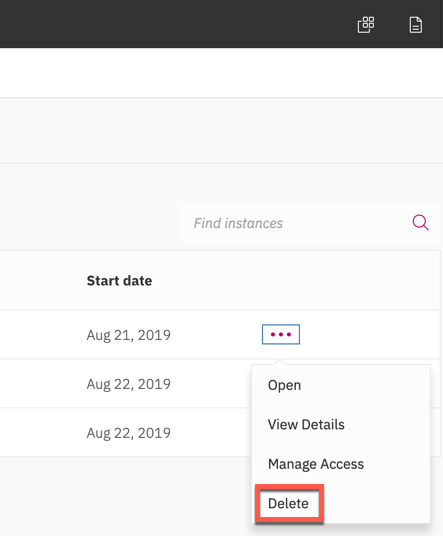

---

copyright:
  years: 2015, 2020
lastupdated: "2020-07-01"

subcollection: assistant-data

---

{:shortdesc: .shortdesc}
{:new_window: target="_blank"}
{:external: target="_blank" .external}
{:deprecated: .deprecated}
{:important: .important}
{:note: .note}
{:tip: .tip}
{:pre: .pre}
{:codeblock: .codeblock}
{:screen: .screen}
{:javascript: .ph data-hd-programlang='javascript'}
{:java: .ph data-hd-programlang='java'}
{:python: .ph data-hd-programlang='python'}
{:swift: .ph data-hd-programlang='swift'}
{:download: .download}
{:gif: data-image-type='gif'}

# Installing Watson Assistant 1.4
{: #install-140}

Use {{site.data.keyword.conversationfull}} for {{site.data.keyword.icp4dfull}} to build conversational interfaces into any app, device, or channel. 
{: shortdesc}

Use this installation method if you do not have a {{site.data.keyword.icp4dfull}} cluster. These instructions describe how to install {{site.data.keyword.icp4dfull}} as a stand-alone deployment or as a Red Hat OpenShift V3.11 deployment. You then add {{site.data.keyword.conversationshort}} to it as an service.

## Application details
{: #install-140-wa-details}

### Microservices
{: #install-140-microservices}

Microservices are individual components that together comprise a service. {{site.data.keyword.conversationshort}} consists of the following microservices:

- **NLU (Natural Language Understanding)**: Interface for store to communicate with the back-end to initiate ML training.
- **Dialog**: Dialog runtime, or user-chat capability.
- **ed-mm**: Manages contextual entity capabilities.
- **Master**: Controls the lifecycle of underlying intent and entity models.
- **Recommends**: Supports recommendations from Watson, such as dictionary-based entity synonyms and intent conflicts. 
- **SIREG** - Manages tokenization and system entity capabilities.
- **skill-conversation**: Manages dialog skills.
- **skill-search**: Manages search skills.
- **SLAD**: Manages service training capabilities.
- **Store**: API endpoints.
- **TAS**: Manages services model inferencing.
- **UI**: Provides the developer user interface.

In addition to these microservices, the Helm chart installs the following resources:

- **PostgreSQL**: Stores training data. Includes the components keeper, sentinel, and proxy.
- **MongoDB**: Stores word vectors.
- **Redis**: Used by the {{site.data.keyword.conversationshort}} tool to store web session-related data.
- **etcd**: Manages service registration and discovery.
- **Minio**: Stores CLU models.

### Language considerations
{: #install-140-lang-reqs}

The components that are necessary to process some natural languages require more resources. The following languages require that additional CPU and memory be available for the installation.

Table 1. Language resource requirements

| Language | Pods for production | Pods for development | Additional memory requirements per pod | 
|----------|---------------------|----------------------|----------------------------------------|
| Chinese (Simplified or Traditional or both) | 2 | 1 | 8 GB |
| German | 2 | 1 | 2 GB |
| Japanese | 2 | 1 | 2 GB |
| Korean | 2 | 1 | 4 GB |
{: caption="Language resource requirements" caption-side="top"}

Each of these languages requires an additional VPC for a production deployment and an additional 1/2 VPC for a development deployment.

For the full list of supported languages, see [Supported languages](/docs/assistant-data?topic=assistant-data-language-support).

## System requirements
{: #install-140-reqs-over}

For details of the minimum requirements that must be met to support {{site.data.keyword.icp4dfull}} itself, see [System requirements](https://www.ibm.com/support/knowledgecenter/SSQNUZ_2.5.0/cpd/plan/rhos-reqs.html){: external}. 

### Service requirements
{: install-140-reqs-addon}

Before you install the service, ensure that you have sufficient resources to run the service. The following resources are required in addition to the minimum platform requirements. 

In development:

- Minimum worker nodes: 3
- Minimum CPU available: 7
- Minimum memory available: 75Gi
- Minimum disk per node available: 500 GB

In production:

- Minimum worker nodes: 5
- Minimum CPU available: 10
- Minimum memory available: 120Gi
- Minimum disk per node available: 500 GB

### Optimal deployment configuration for development
{: #install-140-tested-sys-reqs-dev}

Table 2. Hardware verified to support a development deployment of the service with {{site.data.keyword.icp4dfull_notm}} Lite

| Number of nodes | CPU per node | Memory per node (GB) | Disk per node (GB) |
|-----------------|--------------|-----------------|---------------|
| 3 | 8 | 64 | 500 |
{: caption="Non-production hardware requirements" caption-side="top"}

Keep in mind that in a cluster environment, where CPU and memory are assigned to containers dynamically, CPU and memory resources can become stranded on nodes, leaving insufficient resources to schedule subsequent workloads. In particular, the process of training a machine learning model requires at least one node to have 4 CPUs that can be dedicated to training. This capacity is only needed when training occurs, which happens after changes are made to the training data for an assistant.
{: important}

<!-- ### Optimal deployment configuration for production
{: #install-140-tested-sys-reqs-prod}

Table 2. Hardware verified to support a production deployment of the service

| Node type | Number of nodes | CPU per node | Memory per node (GB) | Disk per node (GB) |
|-----------|-----------------|--------------|-----------------|---------------|
| worker | 4 | 8 | 64 | 500 |
{: caption="Production hardware requirements" caption-side="top"}
-->
The systems that host {{site.data.keyword.conversationshort}} must meet these additional requirements:

- {{site.data.keyword.conversationshort}} for {{site.data.keyword.icp4dfull_notm}} can run on Intel architecture nodes only.
- CPUs must have 2.4 GHz or higher clock speed
- CPUs must support Linux SSE 4.2
- CPUs must support the AVX2 instruction set extension. See the [Advanced Vector Extensions](https://en.wikipedia.org/wiki/Advanced_Vector_Extensions#CPUs_with_AVX2){: external} Wikipedia page for a list of CPUs that include this support (most CPUs since 2013). The service cannot function properly without AVX2 support.

## Storage requirements (development deployments only)
{: #install-140-storage-reqs}

The following table lists the storage resources that are required to support a deployment that uses local storage. 

Local storage is typically used for development deployments only.
{: important}

Table 3. Storage requirements

| Component | Number of replicas | Space per pod | Storage type |
|-----------|-----------------|--------------|
| Postgres  | 3 | 10 GB | local-storage |
| etcd      | 5 | 10 GB | local-storage |
| Minio     | 4 |  5 GB | local-storage |
| MongoDB   | 3 | 80 GB | local-storage |
{: caption="Storage requirements" caption-side="top"}

### Creating persistent volumes
{: #install-140-create-pvs}

A PersistentVolume (PV) is a unit of storage in the cluster. In the same way that a node is a cluster resource, a persistent volume is also a resource in the cluster.

For an overview, see [Persistent Volumes in the Kubernetes documentation ](https://kubernetes.io/docs/concepts/storage/persistent-volumes/){: external}.

Follow the correct procedure for your deployment.

- [Creating persistent volumes for a production environment](#install-140-create-pvs-prod)
- [Creating persistent volumes for a development environment](#install-140-create-pvs-dev)

#### Creating persistent volumes for a production environment
{: #install-140-create-pvs-prod}

To deploy resilient storage in a production environment, do not use the script that is provided in the archive file. The script creates local storage volumes that are meant for deployments into a development or test environment.

Instead, consider using an {{site.data.keyword.icp4dfull_notm}} storage [service](https://www.ibm.com/support/knowledgecenter/SSQNUZ_2.5.0/cpd/svc/storage-svc.html){: external}.

#### Portworx storage
{: #install-140-portworx}

If you choose to use Portworx, you do not need to create persistent volumes before you install the product. Portworx dynamically creates persistent volumes. 

  When enabled, Portworx grabs unmounted disks to use. For example, if you have 7 worker nodes in your cluster, 4 of which have unmounted disks of 400G each, Portworx might provision each worker node with 3 to 4 pods-worth of persistent volumes.

  To use Portworx storage with a stand-alone deployment:
  
  1. Follow the instructions for installing Portworx on Kubernetes helm. (Follow the storage service link provided earlier.) 

     You must be a cluster administrator to install Portworx in the cluster.
     {: note}

  1. If you are installing on stand-alone {{site.data.keyword.icp4dfull_notm}} only: After installing the storage, edit the `spec.yaml` file that is generated by the Portworx spec generator.

     - Change the `node-get-put-list-role` ClusterRole podsecuritypolicies to the following value:

        ```yaml
        - apiGroups: ['policy']
         resources: ['podsecuritypolicies']
        verbs:     ['use']
         resourceNames:
        - 'ibm-privileged-psp'
        ```
        {: codeblock}

     - To prevent ImagePullBackOff errors from occuring, add the following information to the file:

        ```yaml
        imagePullSecrets:
         - name: "sa-kube-system"
        ```
        {: codeblock}

        where `sa-kube-system` is the secret name for the kube-system namespace where Portworx is installed. Specify whatever secret name you used.

  1.  Run the following command to apply the specification that that is generated by the Portworx spec generator:

      ```bash
      kubectl apply -f spec.yaml
      ```
      {: pre}
  
  1.  Define the storage class.

      Create a YAML file in which you define the storage class for the persistent volume.

      ```yaml
      kind: StorageClass
      apiVersion: storage.k8s.io/v1
      metadata:
        name: portworx-assistant
      provisioner: kubernetes.io/portworx-volume
      parameters:
         repl: "3"
         priority_io: "high"
         snap_interval: "0"
         io_profile: "db"
         block_size: "64k"
      ```
      {: codeblock}

  1.  Push the configuration change to the cluster. Use the [apply](https://kubernetes.io/docs/concepts/cluster-administration/manage-deployment/#kubectl-apply){: external} command in a command with the following syntax:

      ```bash
      kubectl apply -f {pv-yaml-file-name}
      ```
      {: pre}

      where `{pv-yaml-file-name}` is the YAML file you created in the previous step.

  1. Configure {{site.data.keyword.conversationshort}} for {{site.data.keyword.icp4dfull_notm}} to use the storage.  Override the persistent volume storage class setting in the **values.yaml** file. By default, it is set to use `local-storage`. You can specify `portworx-assistant` instead. This class sets the provisioner to kubernetes.io/portworx-volume. Specifically, you must override the following values:

    - cos.minio.persistence.storageClass: portworx-assistant
    - etcd.config.dataPVC.storageClassName: portworx-assistant
    - postgres.config.persistence.storageClassName: portworx-assistant
    - mongodb.config.persistentVolume.storageClass: portworx-assistant

  For information about how to override values in the values.yaml file, see one of the following sections:

  - Stand-alone: [Customize the configuration](#install-140-cpd-config)
  - OpenShift: [Customize the configuration](#install-140-os-config)

#### Creating persistent volumes for a development environment
{: #install-140-create-pvs-dev}

A script named **createLocalVolumePV.sh** is included in the archive file that you can use to create persistent volumes for a development deployment only. 

Do not use the script to create persistent volumes for a production deployment.
{: important}

When you install the service, persistent volume claims are created for the components automatically. However, when the preferred storage class for the service is **local-storage**, which is the default setting, you must explicitly create the persistent volumes in the cluster before you install the service.

Because the script that you need to run is included in the archive package, you cannot create the volumes until after you download and unpack the PPA archive file for the Helm chart. Start the installation process and return to this section when you get to the point in the procedure where the persistent volumes must be created. Skip to [Installation overview](#install-140-choose-cluster).

Use the **createLocalVolumePV.sh** script to create persistent volumes that are bounded to cluster nodes where data stores such as MongoDB and Postgres will run. Volumes that you create with the script are assigned a label that uses the release name. This label is used later to bound each volume to the correct datastore pods. 

This script creates a file named **wa-persistence.yaml**. This YAML file adds configuration values that prevent dynamic provisioning from being applied to the volumes. You will reference this YAML file from the *--values* parameter when you install the product.

You will need to choose available worker nodes that can host the persistent volumes. Find out which worker nodes are available to host the volumes by running the following command:

```bash
kubectl get nodes
```
{: pre}

From the list of nodes that is returned, choose 5 nodes where you want the persistent volumes to reside. Make a note of the node IP addresses because you will pass them as arguments to the `--nodeAffinities` parameter later.

Be careful if you need to update or stop a node with bounded local-storage persistent volumes to perform maintenance tasks.

To create persistent volumes, complete the following steps:

You must be a cluster administrator to create local storage volumes, and the script used to create them must be run from the coordinator node of the cluster.
{: important}

1.  On the coordinator node, change to the **/path/to/ibm-watson-assistant-prod/ibm_cloud_pak/pak_extensions/pre-install** subdirectory of the archive file that you extracted the product files from earlier.

1.  If you want to see all of the options that are available to you when you create persistent volumes, run the following command:

    ```bash
    ./clusterAdministration/createLocalVolumePV.sh --help
    ```
    {: pre}

    The rest of these steps describe how to set up basic local storage persistent volumes with node affinity.

1.  Run the **createLocalVolumePV.sh** script to create the persistent volumes. 

    The parameters to include differ depending on whether you want to enable node affinity or not.

    ```bash
    ./clusterAdministration/createLocalVolumePV.sh [--release ${release-name}] [--path PATH] --nodeAffinities NODE1,NODE2,NODE3,NODE4,NODE5
    ```
    {: pre}

    - `release`: Specify the release name. The release name must start with an alphabetic character, end with an alphanumeric character, and consist of all lower case alphanumeric characters or a hyphen (-). For example *my-140-wa*. This release name is added to the labels that are used in the `wa-persistence.yaml` file. Be sure to use the same release name when you run the service install command later.
    - `path`: Specify a directory path for the physical location of the volume on the nodes. If you don't, the path `/mnt/local-storage/storage/watson/assistant` is used. The script appends two directories to the path: a ${release-name} and a unique directory name for each volume, such as `mongodb-80gi-1`, to the end of the path you specify.
    - `nodeAffinities`: This parameter creates persistent volumes with node affinity. Pass as arguments the node IP addresses, separated by commas, for five of the worker nodes that were returned when you ran the `kubectl get nodes` command.

    For more information about the commands used in the script, see [Creating a PersistentVolume](https://www.ibm.com/support/knowledgecenter/en/SSBS6K_3.2.1/manage_cluster/create_volume.html){: external}.

    For example:

    ```bash
    ./createLocalVolumePV.sh --release my-140-wa --path /mnt/local-storage/storage/watson/assistant --nodeAffinities 192.18.36.181,192.18.36.182,192.18.36.183,192.18.36.184,192.18.36.185
    ```
    {: codeblock}

1.  Use the following command to verify that the persistent volumes were created successfully.

    ```bash
    kubectl get persistentvolumes -l release=${release-name} --show-labels
    ```
    {: pre}

The resulting list contains information like this:

| NAME | CAPACITY | LABELS |
|------|----------|--------|
| wa-my-140-wa-etcd-10gi-1 | 10Gi | dedication=wa-my-140-wa-etcd,release=my-140-wa |
| wa-my-140-wa-etcd-10gi-2 | 10Gi | dedication=wa-my-140-wa-etcd,release=my-140-wa |
| wa-my-140-wa-etcd-10gi-3 | 10Gi | dedication=wa-my-140-wa-etcd,release=my-140-wa |
| wa-my-140-wa-etcd-10gi-4 | 10Gi | dedication=wa-my-140-wa-etcd,release=my-140-wa |
| wa-my-140-wa-etcd-10gi-5 | 10Gi | dedication=wa-my-140-wa-etcd,release=my-140-wa |
| wa-my-140-wa-minio-5gi-1 | 5Gi | dedication=wa-my-140-wa-minio,release=my-140-wa | 
| wa-my-140-wa-minio-5gi-2 | 5Gi | dedication=wa-my-140-wa-minio,release=my-140-wa |
| wa-my-140-wa-minio-5gi-3 | 5Gi | dedication=wa-my-140-wa-minio,release=my-140-wa |
| wa-my-140-wa-minio-5gi-4 | 5Gi | dedication=wa-my-140-wa-minio,release=my-140-wa |
| wa-my-140-wa-mongodb-80gi-1 | 80Gi | dedication=wa-my-140-wa-mongodb,release=my-140-wa |
| wa-my-140-wa-mongodb-80gi-2 | 80Gi | dedication=wa-my-140-wa-mongodb,release=my-140-wa |
| wa-my-140-wa-mongodb-80gi-3 | 80Gi | dedication=wa-my-140-wa-mongodb,release=my-140-wa |
| wa-my-140-wa-postgres-10gi-1 | 10Gi | dedication=wa-my-140-wa-postgres,release=my-140-wa | 
| wa-my-140-wa-postgres-10gi-2 | 10Gi | dedication=wa-my-140-wa-postgres,release=my-140-wa |
| wa-my-140-wa-postgres-10gi-3 | 10Gi | dedication=wa-my-140-wa-postgres,release=my-140-wa |
{: caption="Unique persistent volume information" caption-side="top"}

The following information is also provided, but is the same for all volumes:

| ACCESS MODES | RECLAIM POLICY | STATUS | STORAGECLASS |
|--------------|----------------|--------|--------------|
| RWO | Retain | Available | local-storage |
{: caption="Static persistent volume information" caption-side="top"}

## Installation overview
{: #install-140-choose-cluster}

The intallation steps you need to perform differ slightly depending on whether you are installing the service to a stand-alone instance of {{site.data.keyword.icp4dfull}} or on a Red Hat OpenShift cluster. Follow the appropriate set of instructions for your deployment.

- [Installing on OpenShift](#install-140-openshift)
- [Installing on stand-alone {{site.data.keyword.icp4dfull_notm}}](#install-140-cpd)

## Installing on an OpenShift {{site.data.keyword.icp4dfull_notm}} cluster
{: #install-140-openshift}

### OpenShift software prerequisites

- IBM Cloud Pak for Data V2.1.0.2 or V2.5 with Red Hat OpenShift V3.11
- Kubernetes V1.11.0
- Helm V2.9.0 for V2.1.0.2
- Helm V2.14.3 for V2.5

Follow these steps to install {{site.data.keyword.conversationshort}} for {{site.data.keyword.icp4dfull_notm}} on Red Hat OpenShift.

1.  [Purchase and download installation artifacts](#install-140-os-download-wa-cpd)
1.  [Install {{site.data.keyword.icp4dfull_notm}} on OpenShift](#install-140-os-install-icp4d)
1.  [Log in and access the appropriate namespace](#install-140-os-create-namespace)
1.  [Apply security policy to namespace](#install-140-os-securitypolicy)
1.  [Set up access to 2.14.3 Tiller (V2.5 only)](#install-140-os-setup-tiller)
1.  [Extract files from the chart](#install-140-os-extract)
1.  [Load the docker images](#install-140-os-load-docker-images)
1.  [Create persistent volumes](#install-140-os-create-pvs)
1.  [Add required namespace label](#install-140-os-apply-namespace-label)
1.  [Customize the configuration](#install-140-os-config)
1.  [Fetch secrets](#install-140-os-fetch-secrets)
1.  [Install from the Helm chart](#install-140-os-load-helm-chart)

### Step 1: Purchase and download installation artifacts
{: #install-140-os-download-wa-cpd}

After you purchase the service, you download the software as a Passport Advantage archive (PPA) file. The PPA file for {{site.data.keyword.conversationshort}} contains a Helm chart and images. Helm is the Kubernetes package management system that is used for application management inside an {{site.data.keyword.icp4dfull_notm}} cluster.

1.  Purchase {{site.data.keyword.conversationshort}} for {{site.data.keyword.icp4dfull_notm}} from [Passport Advantage](https://www.ibm.com/software/passportadvantage/index.html){: external}.

    Search for `IBM Cloud Pak for Data Watson Assistant V1.4.0`.

1.  Use the Secure Shell protocol (ssh) to log in to the system that you will use as the coordinator node of your cluster as the root user.

1.  Change to the directory where you want the installation files to be stored.

1.  Download the service archive file. The file is named `IBM Cloud Pak for Data Watson Assistant V1.4.0`. 

    The service archive file is large (over 28 GB); the download can take up to an hour to complete over a network connection.

1.  Download the cluster package itself. You can choose the version to install:

    - {{site.data.keyword.icp4dfull}} Enterprise Edition v2.1.0.2 Lite - Bootstrap Config for Red Hat OpenShift (part number CC3E6ML). Version 2.1.0.2 Lite is the Red Hat-certified version of {{site.data.keyword.icp4dfull}}.

    - {{site.data.keyword.icp4dfull}} Enterprise Edition V2.5.

### Step 2: Install {{site.data.keyword.icp4dfull_notm}} on OpenShift
{: #install-140-os-install-icp4d}

1.  Install {{site.data.keyword.icp4dfull_notm}} on Red Hat OpenShift.

    Follow the instructions for [Installing on OpenShift](https://www.ibm.com/support/knowledgecenter/SSQNUZ_2.5.0/cpd/install/rhos-install.html){:external}.

1.  Review the following topics about cluster security and take steps to implement any security measures that you want to have in place before you install the service:

- [Security considerations](https://www.ibm.com/support/knowledgecenter/SSQNUZ_2.5.0/cpd/plan/security.html){: external}

  Encryption of data at rest must be managed by the storage provider.
  {: important}

- [Use a custom TLS certificate on OpenShift](https://www.ibm.com/support/knowledgecenter/SSQNUZ_2.5.0/cpd/install/https-config-openshift.html){: external}

### Step 3: Log in and access the appropriate namespace
{: #install-140-os-create-namespace}

Install the service into the same namespace where {{site.data.keyword.icp4dfull_notm}} is installed, which is typically `zen`.

1.  Log into OpenShift and docker:

    ```bash
    oc login
    ```
    {: pre}

    ```bash
    docker login -u $(oc whoami) -p $(oc whoami -t) {docker-registry} 
    ```
    {: pre}

      - `{docker-registry}` is the address of the internal OpenShift docker registry. For example `docker-registry.default.svc:5000/`

1.  Make sure you are pointing at the correct OpenShift project:

    ```bash
    oc project {namespace-name}
    ```
    {: pre}

      - `{namespace-name}` is the OpenShift project (and Kubernetes namespace) where {{site.data.keyword.conversationshort}} will be installed. This must be the same namespace where {{site.data.keyword.icp4dfull_notm}} is installed, such as `zen`.

### Step 4: Apply security policy to namespace
{: #install-140-os-securitypolicy}

The chart requires a SecurityContextConstraints to be bound to the target namespace prior to installation.

The predefined SecurityContextConstraints name: `restricted` has been verified for this chart. If your target namespace is bound to this SecurityContextConstraints resource, skip this step. 

1.  Run the following command to bind the SecurityContextConstraints to your namespace:

    ```bash
    oc adm policy add-scc-to-group restricted system:serviceaccounts:{namespace-name}
    ```
    {: pre}

    - `{namespace-name}` is the namespace where {{site.data.keyword.conversationshort}} will be installed, which is typically `zen`.

For more information, see [IBM Cloud Pak SecurityContextConstraints Definitions](https://github.com/IBM/cloud-pak/blob/master/spec/security/scc/README.md){: external}.

### Step 5: Set up access to Tiller (V2.5 only)
{: #install-140-os-setup-tiller}

Ensure that you can run Helm commands with version 2.14.3 of Tiller.

1.  Establish the certificate and key for Helm tiller V2.14.3.

    ```bash
    export TILLER_NAMESPACE=zen
    oc get secret helm-secret -n $TILLER_NAMESPACE -o yaml|grep -A3 '^data:'|tail -3 | awk -F: '{system("echo "$2" |base64 --decode > "$1)}'
    export HELM_TLS_CA_CERT=$PWD/ca.cert.pem
    export HELM_TLS_CERT=$PWD/helm.cert.pem
    export HELM_TLS_KEY=$PWD/helm.key.pem
    helm version  --tls
    ```
    {: codeblock}

    The export command assumes that your cluster is installed in the `zen` namespace.
    {: note}

You should see output that looks like this:

```bash
Client: &version.Version{SemVer:"v2.14.3", GitCommit:"0e7f3b6637f7af8fcfddb3d2941fcc7cbebb0085", GitTreeState:"clean"}
Server: &version.Version{SemVer:"v2.14.3", GitCommit:"0e7f3b6637f7af8fcfddb3d2941fcc7cbebb0085", GitTreeState:"clean"}
```
{: codeblock}

### Step 6: Extract files from the archive
{: #install-140-os-extract}

After the archive file is loaded into the cluster, you can extract files from it. There are scripts provided with the chart that you can use to perform tasks.

1.  Change to the directory where you downloaded the archive file, and then use the following command to expand the archive. 

    ```bash
    cd {compressed-file-dir}
    ```
    {: pre}

    ```bash
    tar xvfz {compressed-file-name}
    ```
    {: pre}

    - `{compressed-file-dir}` is the directory into which you downloaded the archive file.
    - `{compressed-file-name}` is the name of the file that you downloaded from Passport Advantage.

1.  Extract the files from the Helm chart package with the following command:

    ```bash
    cd {compessed-file-dir}/charts
    ```
    {: pre}

    ```bash
    tar xvfz ibm-watson-assistant-prod-1.4.0.tgz
    ```
    {: pre}

    The root directory that is extracted from the package is named **ibm-watson-assistant-prod**.

### Step 7: Load the docker images
{: #install-140-os-load-docker-images}

1.  Load the docker images into the OpenShift docker registry:

    ```bash
    cd {compressed-file-dir}/charts/ibm-watson-assistant-prod/ibm_cloud_pak/pak_extensions/pre-install/clusterAdministration
    ./loadImagesOpenShift.sh --path {compressed_file_dir} --namespace {namespace-name} --registry {docker-registry}
    ```
    {: codeblock}

    where `{docker-registry}` is the address of the internal OpenShift docker registry. For example `docker-registry.default.svc:5000`.

    To confirm that the load was successful, check that the docker images are available in the OpenShift docker registry. You can use the following command to check.

    ```bash
    oc get images
    ```
    {: pre}

### Step 8: Create persistent volumes
{: #install-140-os-create-pvs}

See [Creating persistent volumes](#install-140-create-pvs).

### Step 9: Add required namespace label
{: #install-140-os-apply-namespace-label}

The following script is provided with the Watson Assistant archive package.

- `labelNamespace.sh`: Adds the cluster namespace label to your namespace. The label is needed to permit communication between your application's namespace and the {{site.data.keyword.icp4dfull_notm}} namespace using a network policy.

You must be a cluster administrator to run the script.
{: important}

1.  Run the `labelNamespace.sh` script.

    This command assumes that you used `zen` as the {{site.data.keyword.icp4dfull_notm}} namespace when you installed {{site.data.keyword.icp4dfull_notm}}. If you used a different namespace name, then specify it instead.
    {: note} 

    ```bash
    cd {compressed-file-dir}/charts/ibm-watson-assistant-prod/ibm_cloud_pak/pak_extensions/pre-install/clusterAdministration
    ./labelNamespace.sh zen
    ```
    {: codeblock}

### Step 10: Customize the configuration
{: #install-140-os-config}

The configuration settings for the deployment are defined in a file named `values.yaml`. Create a copy of the file and name it `values-override.yaml`. In this override file, you can change values for some of the default configuration settings to customize your service deployment.

1.  Make a copy of the `values.yaml` file, which is stored in the `{compressed-file-dir}/charts/ibm-watson-assistant-prod` directory.

    ```bash
    cp values.yaml values-override.yaml
    ```
    {: pre}

1.  Open the `values-override.yaml` file in a text editor.

1.  Replace any values that you want to change.

   At a minimum, you must provide your own values for the following configurable settings:

    - `global.deploymentType`: Specify whether you want to set up a **Development** or **Production** instance. These values are proper case and the setting is case sensitive.
    - `global.image.repository`:  Specify your docker registry url, including the {namespace-name}. For example: `docker-registry.default.svc:5000/{namespace-name}/`
    - `global.icp.masterHostname`: Specify the hostname of the coordinator node of your cloud instance. Do not include the protocol prefix (`https://`) or port number (`:8443`). If you are using a load balancer, specify the load balancer hostname. For example: `my.company.name.cpd.net` or ` mywacluster-balancer.example.com`.
    - `global.icp.masterIP`: Specify the IP address of the coordinator node. If you are using a load balancer and have multiple coordinator nodes, specify the private IP address of coordinator node number 1.
    - `global.languages.{language-name}`: Change the value for an individual language to **true** to enable it. Only English is enabled by default. Additional resources are required to add support for some languages. See [Language considerations](#install-140-lang-reqs).

      Be sure to specify all of the languages that you want to support now. You cannot add support for more languages later.
      {: important}
  
    - `license`: Read the license files that are provided in the `LICENSES` directory within the archive package. If you agree to the terms, set this configuration setting to **accept**. 

       You cannot install the product if you do not accept the license.
       {: note}

    - `ingress.wcnAddon.addon.maxDeployments`: If you are installing the chart a subsequent time to deploy the product more than once in a single cluster, then you must add this configuration setting and set its value to `2` or higher. The setting is specified in a separate YAML file with a default value of `1`, which enforces the rule that you can deploy {{site.data.keyword.conversationshort}} one time only in a single cluster by default.

      For example:

      ```yaml
      ingress:
        wcnAddon:
          addon:
            maxDeployments: "2"
      ```
      {: codeblock}

    Currently, the service does not support the ability to provide your own instances of resources, such as Postgres or MongoDB. The values YAML file has `{resource-name}.create` settings that suggest you can do so. However, do not change these settings from their default value of `true`.
    {: important}
   
    - `global.zenNamespace`: If {{site.data.keyword.icp4dfull_notm}} is installed to a namespace other than `zen`, then edit this property to change the value of this property to the {{site.data.keyword.icp4dfull_notm}} cluster's namespace name.

1.  Save and close the `values-override.yaml` file.

For information about other values in the YAML file, see the values and their descriptions in the README file that is included in the archive package.

### Step 11: Fetch secrets
{: #install-140-os-fetch-secrets}

Fetch the imagePullSecret that will be used for training.

1.  Run the following command:

    ```bash
    oc get secrets | grep default-dockercfg
    ```
    {: pre}

### Step 12: Install from the Helm chart
{: #install-140-os-load-helm-chart}

1.  Install the chart from the Helm command line interface. 

    Enter the following command from the directory where the package was loaded in your local system:

    ```bash
    helm install {compressed-file-dir}/charts/ibm-watson-assistant-prod [--tls] --set master.slad.dockerRegistryPullSecret={training-secret} --values {compressed-file-dir}/charts/ibm-watson-assistant-prod/values-override.yaml --namespace {namespace-name} --name {release-name} [--values wa-persistence.yaml] [--tiller-namespace {namespace-name}]
    ```
    {: codeblock}

    - The `{compressed-file-dir}/charts/ibm-watson-assistant-prod` parameter represents the name of the downloaded file that contains the Helm chart.
    - Add the `--tls` argument to enable TLS security for Helm 2.14.3 with IBM Cloud Pak for Data V2.5.
    - Replace `{training-secret}` with the name of the secret you discovered in the previous step.
    - Replace `{namespace-name}` with the name of the Kubernetes namespace where {{site.data.keyword.conversationshort}} will be installed, which is typically `zen`.
    - Replace `{release-name}` with a name for your release. The release name must start with an alphabetic character, end with an alphanumeric character, and consist of lower case alphanumeric characters or a hyphen (-). For example *my-140-wa*.
    - Specify the `--values wa-persistence.yaml` argument if you are using local persistent volumes. This file was generated automatically when you ran the `createLocalVolumePV.sh` script.

Jump to [Verifying that the installation was successful](#install-140-verify).

## Installing on a stand-alone {{site.data.keyword.icp4dfull_notm}} deployment
{: #install-140-cpd}

### Stand-alone IBM Cloud Pak for Data software prerequisites

- IBM Cloud Pak for Data V2.1.0.2
- Kubernetes V1.11.0
- Helm V2.9.1

Follow these steps to install {{site.data.keyword.conversationshort}} for {{site.data.keyword.icp4dfull_notm}}.

1.  [Purchase and download installation artifacts](#install-140-cpd-download-wa-cpd)
1.  [Install {{site.data.keyword.icp4dfull_notm}}](#install-140-cpd-install-icp4d)
1.  [Upload the archive file](#install-140-cpd-upload-archive)
1.  [Extract files from the chart](#install-140-cpd-extract)
1.  [Create persistent volumes](#install-140-cpd-create-pvs)
1.  [Set up security policies](#install-140-cpd-apply-security-policy)
1.  [Create the image policy](#install-140-cpd-image-policy)
1.  [Customize the configuration](#install-140-cpd-config)
1.  [Install from the Helm chart](#install-140-cpd-load-helm-chart)

### Step 1: Purchase and download installation artifacts
{: #install-140-cpd-download-wa-cpd}

After you purchase the service, you download the software as a Passport Advantage archive (PPA) file. The PPA file for {{site.data.keyword.conversationshort}} contains a Helm chart and images. Helm is the Kubernetes package management system that is used for application management inside an {{site.data.keyword.icp4dfull_notm}} cluster.

1.  Purchase {{site.data.keyword.conversationshort}} for {{site.data.keyword.icp4dfull_notm}} from [Passport Advantage](https://www.ibm.com/software/passportadvantage/index.html){: external}.

    Search for `{{site.data.keyword.conversationshort}} for {{site.data.keyword.icp4dfull_notm}} 1.4.0`.

1.  Use the Secure Shell protocol (ssh) to log in to the system that you will use as the coordinator node of your cluster as the root user.

1.  Change to the directory where you want the installation files to be stored.

1.  Download the archive files.

    - {{site.data.keyword.icp4dfull}} Enterprise Edition V2.1.0.2 (0.5 MB)
    - {{site.data.keyword.conversationshort}} for {{site.data.keyword.icp4dfull_notm}} V1.4.0 (over 28 GB)

    The service archive download can take up to an hour to complete over a network connection.

### Step 2: Install {{site.data.keyword.icp4dfull_notm}}
{: #install-140-cpd-install-icp4d}

1.  Install {{site.data.keyword.icp4dfull_notm}}. 

    Follow the instructions to install and set it up that begin with [Installing](https://www.ibm.com/support/knowledgecenter/SSQNUZ_2.1.0/com.ibm.icpdata.doc/zen/install/standovu.html){: external}.

1.  Review the following topics about cluster security and take steps to implement any security measures that you want to have in place before you install the service:

- [Security in IBM Cloud Pak for Data](https://www.ibm.com/support/knowledgecenter/SSQNUZ_2.1.0/com.ibm.icpdata.doc/zen/overview/security.html){: external}

  Encryption of data at rest must be managed by the storage provider.
  {: important}

- [Use a custom SSL or TLS certificate for HTTPS connections to the web client](https://www.ibm.com/support/knowledgecenter/SSQNUZ_2.1.0/com.ibm.icpdata.doc/zen/install/https-config.html){: external}
- Post-installation instructions in [Encrypting cluster data network traffic with IPsec](https://www.ibm.com/support/knowledgecenter/SSBS6K_3.1.2/installing/ipsec_mesh.html#ipsec-certificate-and-key)

### Step 3: Upload the archive file
{: #install-140-cpd-upload-archive}

After the download of the archive file from Passport Advantage is completed, load the file onto the cluster. The file must be available to the cluster before you can use Helm commands to install the service.

If you are installing the helm chart a subsequent time to add another deployment of the service to the same namespace in the same cluster, you can skip this step.
{: tip}

1.  From the {{site.data.keyword.icpfull_notm}} command line interface, run the following command to log in:

    ```bash
    cloudctl login -a {cluster4d-coordinator-node}:8443 -u {admin-user-id} -p {admin-password} 
    ```
    {: pre}

1.  When prompted for a namespace, specify the same namespace in which {{site.data.keyword.icp4dfull_notm}} is installed, which is typically `zen`.

1.  Run the following command to upload the archive file to the cluster:

    ```bash
    cloudctl catalog load-archive --registry {cluster4d-coordinator-node}:8500 --archive {archive-name}.tar.gz --repo local-charts
    ```
    {: pre}

    Do not include a protocol prefix (such as `https://`) with the {cluster4d-coordinator-node} value. If you are using a load balancer, then the {cluster4d-coordinator-node} is the hostname for the load balancer.
    {: important}

    For example:

    ```bash
    cloudctl catalog load-archive --registry mycloud.example.com:8500 --archive {archive-name}.tar.gz --repo local-charts
    ```
    {: pre}

    This process takes a while.

    If there is a chance that the terminal window connection to your cluster may be interrupted before the command completes, you can help the command complete even if you lose your connection. Pause the job, and run it it the background (bg). Then, remove the inheritance path of the interrupt (SIGHUP) signal (disown -h %{job#}) to prevent it from stopping the job prematurely.
    {: tip}

If you get the following error message, it means you included `https://` with the cluster address. Try to load the file again without it.

`Error parsing reference: "https://{cluster4d-coordinator-node}:8500/us.icr.io/icp-common-components/wcn-addon:1.x" is not a valid repository/tag: invalid reference format`

### Step 4: Extract files from the archive
{: #install-140-cpd-extract}

After the archive file is loaded into the cluster, you can extract files from it. There are scripts provided with the chart that you can use to perform tasks such as creating persistent volumes and applying security policies.

1.  Change to the directory where you downloaded the archive file, and then use the following command to expand the archive. 

    This step is important because the `values.yaml`, which defines configuration settings for your deployment, gets populated with information during the process. If you were to extract the files without expanding them, this information would not be populated properly.
    {: important}

    ```bash
    wget --no-check-certificate https://{cluster4d-coordinator-node}:8443/helm-repo/requiredAssets/ibm-watson-assistant-prod-1.4.0.tgz
    ```
    {: pre}

    If you are using a load balancer, then the {cluster4d-coordinator-node} is the hostname for the load balancer.
    {: note}

1.  Extract the files from the Helm chart package with the following command:

    ```bash
    tar -xvf ibm-watson-assistant-prod-1.4.0.tgz
    ```
    {: pre}

    The root directory that is extracted from the package is named **ibm-watson-assistant-prod**.

### Step 5: Create persistent volumes
{: #install-140-cpd-create-pvs}

See [Creating persistent volumes](#install-140-create-pvs).

### Step 6: Set up security policies
{: #install-140-cpd-apply-security-policy}

A set of scripts is provided with the {{site.data.keyword.conversationshort}} archive package. Use the scripts to set up the appropriate security policies. The provided scripts include:

- `createSecurityNamespacePrereqs.sh`: Creates a role binding in the namespace specified and prevents pods that don't meet the `ibm-restricted-psp` pod security policy from being started. The policy named `ibm-restricted-psp` is the most restrictive policy. It requires pods to run with a non-root user ID and prevents pods from accessing the host. The role binding rules are defined in the `ibm-watson-assistant-prod-roldebinding.tpl` file, which is also provided in the archive.
- `labelNamespace.sh`: Adds the cluster namespace label to your namespace. The label is needed to permit communication between your application's namespace and the {{site.data.keyword.icp4dfull_notm}} namespace using a network policy.
 
For more information about the `ibm-restricted-psp` security policy, see the Helm Chart README.md file. A link to the file is available from the table of contents.
{: tip}

You must be a cluster administrator to run the scripts.
{: important}

1.  Change to the `/path/to/ibm-watson-assistant-prod/ibm_cloud_pak/pak_extensions/pre-install` directory.

1.  Run the `createSecurityNamespacePrereqs.sh` script by using the following command:

    ```bash
    cd {compressed-file-dir}/ibm-watson-assistant-prod/ibm_cloud_pak/pak_extensions/pre-install
    ./namespaceAdministration/createSecurityNamespacePrereqs.sh {namespace-name}
    ```
    {: pre}

1.  Run the `labelNamespace.sh` script.

    This command assumes that you used `zen` as the {{site.data.keyword.icp4dfull_notm}} namespace when you installed {{site.data.keyword.icp4dfull_notm}}. If you used a different namespace name, then specify it instead.
    {: note} 

    ```bash
    cd {compressed-file-dir}/ibm-watson-assistant-prod/ibm_cloud_pak/pak_extensions/pre-install
    ./clusterAdministration/labelNamespace.sh zen
    ```
    {: pre}

### Step 7: Create the image policy
{: #install-140-cpd-image-policy}

For each image in a repository, an image policy scope of either cluster or namespace is applied. When you deploy an application, IBM Container Image Security Enforcement checks whether the Kubernetes namespace that you are deploying to has any policy regulations that must be applied.

1.  Create a YAML file named `image_policy.yaml` to define the policy. You can do so by following these steps:

    - Run `vi image_policy.yaml` and press `i`.

    - Paste the following content into the file:

      ```yaml
      apiVersion: securityenforcement.admission.cloud.ibm.com/v1beta1
      kind: ClusterImagePolicy
      metadata:
       name: watson-assistant-{name}-policy
      spec:
       repositories:
          - name: "{cluster4d-coordinator-node}:8500/*"
            policy:
              va:
                enabled: false
      ```
      {: codeblock}

    - Replace the following variables with the appropriate values for your cluster:

      - `{cluster4d-coordinator-node}`: Specify the hostname for the coordinator node of the {{site.data.keyword.icp4dfull_notm}} cluster
      - `{name}`: Specify a name that helps you identify this deployment. You can use the version number of the product, such as 140, for example.

    - Save the file and close the editor by pressing `esc`, typing `:wq` and pressing `Enter`.

1.  Apply the policy by running the following command:

    ```bash
    kubectl apply -f ./image_policy.yaml
    ```
    {: pre}

    If you have any trouble running kubectl commands, see [Enabling access to kubectl](https://www.ibm.com/support/knowledgecenter/SSQNUZ_2.1.0/com.ibm.icpdata.doc/zen/install/kubectl-access.html).

1.  To validate that the policy was applied properly, run the following command:

    ```bash
    kubectl get ClusterImagePolicy
    ```
    {: pre}

    A list of policies is returned. Confirm that the policy you created (for example, watson-assistant-140-policy) is included in the list. 
    
    If you want to list the content of the policy, use this command instead:

    ```bash
    kubectl get ClusterImagePolicy -o yaml
    ```
    {: pre}

### Step 8: Customize the configuration
{: #install-140-cpd-config}

The configuration settings for the deployment are defined in a file named `values.yaml`. Create a copy of the file and name it `values-override.yaml`. In this override file, you can change values for some of the default configuration settings to customize your service deployment.

1.  Make a copy of the `values.yaml` file, which is stored in the `{compressed-file-dir}/ibm-watson-assistant-prod` directory.

    ```bash
    cp values.yaml values-override.yaml
    ```
    {: pre}

1.  Open the `values-override.yaml` file in a text editor.

1.  Replace any values that you want to change.

   At a minimum, you must provide your own values for the following configurable settings:

    - `global.deploymentType`: Specify whether you want to set up a **Development** or **Production** instance. These values are proper case and the setting is case sensitive.
    - `global.image.repository`: Specify your docker registry url, including the {namespace-name}. For example `{cluster4d-coordinator-node}:8500/{namespace-name}`.
    - `global.icp.masterHostname`: Specify the hostname of the coordinator node of your cloud instance. Do not include the protocol prefix (`https://`) or port number (`:8443`). If you are using a load balancer, specify the load balancer hostname. For example: `my.company.name.icp.net` or ` mywacluster-balancer.example.com`.
    - `global.icp.masterIP`: Specify the IP address of the coordinator node. If you are using a load balancer and have multiple coordinator nodes, specify the private IP address of coordinator node number 1.
    - `global.languages.{language-name}`: Change the value for an individual language to **true** to enable it. Only English is enabled by default. Additional resources are required to add support for some other languages. See [Language considerations](#install-140-lang-reqs).
    - `license`: Read the license files that are provided in the `LICENSES` directory within the archive package. If you agree to the terms, set this configuration setting to **accept**. 

       You cannot install the product if you do not accept the license.
       {: note}

    - `ingress.wcnAddon.addon.maxDeployments`: If you are installing the chart a subsequent time to deploy the product more than once in a single cluster, then you must add this configuration setting and set its value to `2` or higher. The setting is specified in a separate YAML file with a default value of `1`, which enforces the rule that you can deploy {{site.data.keyword.conversationshort}} one time only in a single cluster by default.

      For example:

      ```yaml
      ingress:
        wcnAddon:
          addon:
            maxDeployments: "2"
      ```
      {: codeblock}

    Currently, the service does not support the ability to provide your own instances of resources, such as Postgres or MongoDB. The values YAML file has `{resource-name}.create` settings that suggest you can do so. However, do not change these settings from their default value of `true`.
    {: important}

    - `global.zenNamespace`: If {{site.data.keyword.icp4dfull_notm}} is installed to a namespace other than `zen`, then edit this property to change the value of this property to the {{site.data.keyword.icp4dfull_notm}} cluster's namespace name.

1.  Save and close the `values-override.yaml` file.

For information about other values in the YAML file, see the values and their descriptions in the README file that is included in the archive package.

### Step 9: Install from the Helm chart
{: #install-140-cpd-load-helm-chart}

1.  Set the targeted namespace to the namespace of {{site.data.keyword.icp4dfull_notm}}, which is typically `zen`.
    
    ```bash
    cloudctl target -n {namespace-name}
    ```
    {: pre}

1.  Verify that your Helm command line interface context is valid by running this command.

    ```bash
    helm version --tls
    ```
    {: pre}

1.  Install the chart from the Helm command line interface. 

    Enter the following command from the ibm-watson-assistant-prod directory:

    ```bash
    helm install --tls --values {override-file-name} [--values {wa-persistence.yaml}] --namespace {namespace-name) --name {release-name} ibm-watson-assistant-prod-1.4.0.tgz
    ```
    {: pre}
​​​
    - Replace `{override-file-name}` with the path to the file that contains the values that you want to override from the values.yaml file provided with the chart package. For example: `{compressed-file-dir}/ibm-watson-assistant-prod/values-override.yaml`. If you are creating local storage persistent volumes, specify the `wa-persistence.yaml` file by adding a second `--values` agrument.
    - Replace `{namespace-name}` with the name of the Kubernetes namespace where {{site.data.keyword.conversationshort}} will be installed, which is typically `zen`.
    - Replace `{release-name}` with a name for your release. The release name must start with an alphabetic character, end with an alphanumeric character, and consist of lower case alphanumeric characters or a hyphen (-). For example *my-140-wa*.
    - The `ibm-watson-assistant-prod-1.4.0.tgz` parameter represents the name of the downloaded file that contains the Helm chart.

    For example:

    ```bash
    helm install --tls --values values-override.yaml --namespace {namespace-name} --name my140wa ../ibm-watson-assistant-prod-1.4.0.tgz
    ```
    {: pre}

## Troubleshooting the installation
{: #install-140-ts-install}

Review these tips for steps you can take as the service is being installed.

- The Recommends Mongo database can take up to 45 minutes to load. If you want to keep an eye on the progress of the installation of this microservice, you can find the pod to which is it being installed, and monitor its log.

  1. To find the pod, use the following command:

     ```bash
     kubectl get pods | grep recommends-load-mongo
     ```
     {: codeblock}

   1. To follow the log output for the pod, use the following command:

      ```bash
      kubectl logs -f {pod-name}
      ```
      {: codeblock}

      For example:

      ```bash
      kubectl logs -f my-140-wa-recommends-load-mongo-zkxh8
      ```
      {: codeblock}

      where `my-140-wa` is the release name that was used by the installation.

## Verifying that the installation was successful
{: #install-140-verify}

To check the status of the installation process:

1.  Check the status of the deployment by using the following command:

      ```bash
      watch kubectl get job,pod,svc,secret,cm,pvc --namespace {namespace-name}
      ```
      {: pre}

      Be sure to give the product time to be deployed. The pod that hosts the Recommends microservice takes 30-45 minutes to reach the `Running` state.
      {: important}

      ```bash
      helm status [--tls] {release-name} [--tiller-namespace {namespace-name}]
      ```
      {: pre}

      You must add the `--tls` argument if you installed on V2.5 because newer versions of Helm require it.
      {: note}

1.    Take one of the following actions:

      - If a pod fails, try to determine the cause and fix it. Run the following command to see logs for the pod:

        ```bash
        kubectl logs {podname} -n {namespace-name} -f --timestamps
        ```
        {: pre}

        If you cannot resolve the cause of the problem and need to start the installation over, complete the steps in [Uninstalling the service](#install-140-uninstall), so you can start over with a clean set of nodes.

    - If the deployment process was successful, test {{site.data.keyword.conversationshort}} by running a test Helm chart.

        1.  From the Helm command line interface, run the following command:

            ```bash
            helm test --tls {release-name} --timeout 900 [--tiller-namespace {namespace-name}]
            ```
            {: pre}

        1.  If one of the tests fails, review the logs to learn more. To see the log, use a command with the syntax `kubectl logs {podname} -n {namespace-name} -f --timestamps`. For example:

            ```bash
            kubectl logs my-release-test -n zen -f --timestamps
            ```
            {: pre}

        1.  To run the test script again, first delete the test pods. You must delete all of the `{podname}` pods, not just the one that failed, or the other tests will fail also. To do so, use the same `helm test` command again, but with a `cleanup` argument this time. For example:

            ```bash
            helm test --tls {release-name} --cleanup --timeout 900 [--tiller-namespace {namespace-name}]
            ```
            {: pre}

            Now, you can run the original `helm test` command without the *cleanup* argument to rerun the tests.

### Uninstalling the service
{: #install-140-uninstall}

If you need to start the deployment over, be sure to remove all trace of the current installation before you try to install again.

If you need to preserve any data, do so now before you begin this procedure.
{: important}

For OpenScale clusters, use the `oc` command instead of `kubectl` in these steps.
{: note}

1.  {: #install-140-delete-instance-sh}If you got as far as creating one or more instances of the service, then complete the following steps to delete the instances. Otherwise, skip this step.

    1. From the main menu of the {{site.data.keyword.icp4dfull_notm}} web client, go to the **My Instances** page, and then click the **Provisioned instances** tab.

    1. For each {{site.data.keyword.conversationshort}} instance that you provisioned, click the More menu, and then choose **Delete**.

    

    Currently, you cannot delete an instance by clicking the *Delete Instance* button from the details page for the deployment or from the details page for an individual instance.
    {: important}

1.  Before you delete anything else, get a list of the names of the persistent volumes that you created for this deployment.

    ```bash
    kubectl get pv
    ```
    {: pre}

    Make a note of the name of each persistent volume. You will need this information in a later step.

1.  Delete the deployment by using the following command:

    ```bash
    helm delete --tls --no-hooks --purge {release-name} [--tiller-namespace {namespace-name}]
    ```
    {: pre}

1.  Delete any associated artifacts that are left over, such as service data stores that are intentionally preserved, by using the following command. 

    Reminder: This command also removes the data stores you created, which must be removed and recreated if you need to start the installation over.
    {: note}

    ```bash
    kubectl delete job,deploy,replicaset,pod,statefulset,configmap,secret,ingress,service,serviceaccount,role,rolebinding,persistentvolumeclaim,poddisruptionbudget,horizontalpodautoscaler,networkpolicies -l release={release-name}
    ```
    {: pre}

    The `-l` for label is the selector to filter by, where you can specify the release name.

1.  Remove the configmap by using the following command.

    ```bash
    kubectl delete cm stolon-cluster-{release-name}
    ```
    {: pre}

1.  To delete each physical persistent volume, use the following command. 

    You should have a list of the names of each persistent volume that you noted in an earlier step.

    ```bash
    kubectl delete pv (pv-name}
    ```
    {: pre}

Now, you have cleared everything necessary to restart your installation. Your namespace exists and your service archive file is loaded into it, so you can pick up the installation instructions starting from the step in which you create persistent volumes.

## Provisioning an instance of the service
{: #install-140-install-service}

You can provision up to 30 instances of {{site.data.keyword.conversationshort}} per deployment of Watson Assistant.

1.  From the {{site.data.keyword.icp4dfull_notm}} web client, go to the *Services* page. 

    

1.  Find the {{site.data.keyword.conversationshort}} service tile, and then click it.

    The tile shows that the service is *Enabled* only if the service was added to the cluster by following the installation steps that are described earlier.

1.  Click the icon , and then click **Provision instance**.

1.  Name the instance. 

    This is the instance you will share with the users in your organization. They will see this instance name from the product's main page. Choose a unique name that represents the instance's purpose.

1.  Click **Create**.

## Launching the product
{: #install-140-launch-tool}

1.  Open an incognito window in your web browser to prevent cached information from being used by the product.
1.  From the main {{site.data.keyword.icp4dfull_notm}} web client navigation menu, select **My instances**.
1.  On the **Provisioned instances** tab, find your {{site.data.keyword.conversationshort}} instance, and then hover over the last column to show and click the ellipses icon .
1.  Choose **View details**.
1.  Click **Open {{site.data.keyword.conversationshort}}**.

## Adding another deployment
{: #install-140-deploy-again}

You can add as many deployments to the same cluster as you want. However, you must purchase a separate license for each deployment. You must also ensure that each deployment has the additional CPU and memory that it needs.

Follow the same steps to install a second deployment in the cluster as you did the install the first deployment. Install it to the same namespace. And when you edit the `values.yaml` file, be sure to add the `ingress.wcnAddon.addon.maxDeployments` property to the file.

## Next steps
{: #install-140-next-steps}

Use the {{site.data.keyword.conversationshort}} product user interface to build training data and a dialog that can be used by your assistant.

- To learn more about the service first, read the [overview](https://cloud.ibm.com/docs/assistant-data?topic=assistant-data-index).
- To see how it works for yourself, follow the steps in the [getting started tutorial](https://cloud.ibm.com/docs/assistant-data?topic=assistant-data-getting-started).
- For help managing the cluster, see [Managing the cluster](https://cloud.ibm.com/docs/assistant-data?topic=assistant-data-manage-130).

## Troubleshooting issues
{: #install-140-ts-get-logs}

The first step to take if you hit an installation issue, such as a cluster node is not starting as expected, is to get logs from the cluster which can provide more detail.

To get log files, complete the following steps:

1.  Log into the cluster with administrator credentials.

1.  Run the following command to get a list of the jobs that are currently running in the cluster and whether the job was successful:

    ```bash
    kubectl get jobs
    ```
    {: pre}

1.  For any jobs that show a success status of 0, get the log file for the job by entering the following command:

    ```bash
    kubectl log {job-name} -f
    ```
    {: pre}

1.  You can follow the logs of running pods also.

    Use this command to get the pod names:

    ```bash
    kubectl get pods
    ```
    {: codeblock}

1.  To follow the log for a particular pod:

    ```bash
    kubectl logs -f podname
    ```
    {: codeblock}

1.  If you want more detail about a pod because the pod has not started yet or is failing to start at all, for example, you can use the following command to get more details.

    ```bash
    kubectl describe pod podname
    ```
    {: codeblock}

### To check the configuration
{: #install-140-check-config}

If you want to check what configuration settings were applied to a deployment when it was set up, you can run the following command:

```bash
helm get <release-name> --tls [--tiller-namespace {namespace-name}]
```
{: pre}

The user-provided configuration values are listed at the start of the information that is returned.

### Can't create a session using the API
{: #install-140-v2-api}

- **Problem**: You get a 500 response and see an error, such as `"You can't write against a read only worker."` when trying to use the v2 API to create a session.
- **Cause**: Redis sometimes applies the wrong roles to resources.
- **Solution**: Restart the Redis pods. Make a note of the replica numbers for Redis server and Redis sentinel first. Scale the Redis server and Redis sentinel replicas down to 0 and then scale them back to their original numbers. For details, see [To scale the number of replicas](/docs/assistant-data?topic=assistant-data-manage-130#manage-130-scale).
