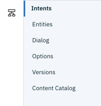

---

copyright:
  years: 2015, 2020
lastupdated: "2020-01-07"

subcollection: assistant-data

---

{:shortdesc: .shortdesc}
{:new_window: target="_blank"}
{:external: target="_blank" .external}
{:deprecated: .deprecated}
{:important: .important}
{:note: .note}
{:tip: .tip}
{:pre: .pre}
{:codeblock: .codeblock}
{:screen: .screen}
{:javascript: .ph data-hd-programlang='javascript'}
{:java: .ph data-hd-programlang='java'}
{:python: .ph data-hd-programlang='python'}
{:swift: .ph data-hd-programlang='swift'}

# Release notes
{: #release-notes}

## Beta features
{: #rn-beta-features}

IBM releases services, features, and language support for your evaluation that are classified as beta. These features might be unstable, might change frequently, and might be discontinued with short notice. Beta features also might not provide the same level of performance or compatibility that generally available features provide and are not intended for use in a production environment. Beta features are supported only on the [IBM Developer Answers](https://developer.ibm.com/answers/topics/watson-assistant/){: external}.

## Change log
{: #rn-change-log}

### 27 November 2019
{: #27November2019}

**{{site.data.keyword.conversationfull}} for {{site.data.keyword.icp4dfull}} version 1.4 is available.**: The following changes were made in this release:

- {{site.data.keyword.conversationshort}} for {{site.data.keyword.icp4dfull}} version 1.4 is compatible with {{site.data.keyword.icp4dfull}} version 2.5.
- The Czech language is not enabled automatically anymore.
- The main menu options of **Assistants** and **Skills** have moved from being displayed at the top of the page to being shown as icons in a new navigation pane.

  -  Assistants
  -  Skills

  The tabbed pages for the tools you use to develop a dialog skill were moved to a secondary navigation bar that is displayed when you open the skill.

  

- **Rich response types are supported in a dialog node with slots**. You can display a list of options for a user to choose from as the prompt for a slot, for example. For more information, see [Gathering information with slots](/docs/services/assistant-data?topic=assistant-data-dialog-slots).
- **Improved Entities, Dialog, and Intents page responsiveness**: The Entities, Dialog, and Intents pages were updated to use a new JavaScript library that increases the page responsiveness. As a result, the look of some graphical user interface elements, such as buttons, changed slightly, but the function did not.
- **Creating contextual entities got easier**: The process you use to annotate entity mentions from intent user examples was improved. You can now put the intent page into annotation mode to more easily select and label mentions. For more information, see [Adding contextual entities](/docs/services/assistant-data?topic=assistant-data-entities#entities-create-annotation-based).
- **Webhook callouts are available**: Add webhooks to dialog nodes to make programmatic calls to an external application as part of the conversational flow. This capability is being introduced as a beta feature. For more details, see [Making a programmatic call from dialog](/docs/services/assistant-data?topic=assistant-data-dialog-webhooks).
- **Testing improvement**: You can now see the top three intents that were recognized in a test user input from the "Try it out" pane. For more details, see [Testing your dialog](/docs/services/assistant-data?topic=assistant-data-dialog-build#dialog-build-test).

This release does not include the following features, which are available for cloud instances at the time of this release:

- There are no metrics or analytics capabilities. Therefore, the *Analytics* page is not included in the product user interface.
- There are no deployment connectors or built-in integrations available. You must build a custom client application that can host the assistant. As a result, the *Integrations* page is not included in the product user interface.
- The @sys-person and @sys-location system entities are not supported.
- There is no search function in the product.
- Autocorrection, intent recommendations, and the new irrelevance detection model are not supported.
- The product tour that is available to some first-time users of the cloud-based product is not available.

### 3 September 2019
{: #3September2019}

**{{site.data.keyword.conversationfull}} for {{site.data.keyword.icp4dfull}} version 1.3 is available.**: The following changes were made in this release:

- Added support for installing {{site.data.keyword.icp4dfull_notm}} with Red Hat OpenShift.
- Federal Information Security Management Act (FISMA) support is available for {{site.data.keyword.conversationshort}} for {{site.data.keyword.icp4dfull_notm}} for this version (V1.3). FISMA support is also available to those who purchased V1.2 (28 June 2019) and upgraded to V1.3. {{site.data.keyword.conversationshort}} for {{site.data.keyword.icp4dfull_notm}} is FISMA High Ready.
- You can now provision up to 30 instances of {{site.data.keyword.conversationshort}} in a single deployment.
- The search skill is now generally available.

This release does not include the following features, which are currently available for cloud instances:

- Autocorrection, intent recommendations, and webhooks are not supported.
- The product tour that is available to some first time users of the cloud-based product is not available.
- The new JavaScript library that is being used in cloud instances to increase the page responsiveness is not in use.

### 28 June 2019
{: #28June2019}

**{{site.data.keyword.conversationfull}} for {{site.data.keyword.icp4dfull}} version 1.2 is available.**: The {{site.data.keyword.conversationshort}} tool now works with {{site.data.keyword.icp4dfull_notm}}. It does not work with stand-alone {{site.data.keyword.icpfull_notm}}. The following changes were made in this release:

- Assistants are now available. An assistant can manage user sessions on your behalf. See [Assistants](/docs/services/assistant-data?topic=assistant-data-assistants).
- Search skill is a new beta feature. You can create a search skill to trigger a search in an external data source that you configure in Watson Discovery. See [Creating a search skill](/docs/services/assistant-data?topic=assistant-data-skill-search-add).
- Instead of creating a workspace as the container for your training data and dialog, you create a dialog skill. See [Creating a dialog skill](/docs/services/assistant-data?topic=assistant-data-skill-dialog-add).
- Prevent your assistant from answering the wrong question by keeping your intents distinct from one another. Intent conflict resolution is now available. It can find intents with overlapping user examples, and gives you a graphical user interface in which to fix them. Nondistinct intents can result in misclassifications of user input. See [Resolving intent conflicts](/docs/services/assistant-data?topic=assistant-data-intents#intents-resolve-conflicts).
- You can opt to see synonym recommendations that are made by Watson as you create a dictionary-based entity. See [Synonyms](/docs/services/assistant-data?topic=assistant-data-entities#entities-synonyms).

For information about upgrading from a previous version, see [Upgrading](/docs/services/assistant-data?topic=assistant-data-upgrade)

### 21 February 2019
{: #21February2019}

**{{site.data.keyword.conversationfull}} for {{site.data.keyword.icpfull}} version 1.1 is available.**: The {{site.data.keyword.conversationshort}} tool now works with {{site.data.keyword.icpfull_notm}} 3.1.0. It does not work with {{site.data.keyword.icpfull_notm}} 2.1.0.3.

- {{site.data.keyword.conversationshort}} for {{site.data.keyword.icpfull_notm}} version 1.1 is compatible with {{site.data.keyword.icp4dfull}} version 1.2.

- The number of required Virtual Private CPUs has decreased from its previous number (of 60 VPCs).

- Language support was improved, which means you do not need as many additional resources when you add support for more languages.

### 23 November 2018
{: #23November2018}

- A revised Helm chart (version 1.0.1) was published, which improves the Helm chart and packaging.
- New configuration settings were added that allow you to specify domain names and IP addresses for the master and proxy nodes of the {{site.data.keyword.icpfull}} cluster. A new checkbox is visible for enabling recommendations; however, do not select it as the feature is not fully supported yet.
- The resources required for a development deployment changed for Minio from one 20 GB replica to four 5 GB replicas. This change means you need to create 13 persistent volumes instead of 10 to support the deployment.

### 5 October 2018
{: #5October2018}

- A revised Helm chart (version 1.0.0.1) was published, which improves the installation process.

### 26 September 2018
{: #26September2018}

- **{{site.data.keyword.conversationfull}} for {{site.data.keyword.icpfull}} 1.0.0 is available.**

  The {{site.data.keyword.conversationfull}} tool includes a Build tab that offers pre-built intents you can add to your workspace from a content catalog, the ability to define your own intents and entities, and has a graphical user interface you can use to build a dialog. The following key features are also available:

  - Dialog: Digression and disambiguation support, nodes with slots, rich responses (including *Connect to human agent*)
  - Entities: Contextual entities, system entities for currency, date, number, percentage, and time.
  - Intents: Content catalog

  These features are not available from {{site.data.keyword.icpfull}}, but are available in the public IBM Cloud instance at the time of this release:

  - There are no metrics or analytics capabilities. Therefore, the *Improve* tab is not included in the tool.
  - There are no deployment connectors or built-in integrations available. You must build a custom client application that can host the assistant. As a result, the *Deploy* tab is not included in the tool.
  - You cannot search within the tool.
  - The @sys-person and @sys-location system entities are not supported.
  - You cannot make programmatic calls to Cloud Functions actions from the dialog.
  - No entity synonym recommendations are available.
  - No intent conflict detection is available.
